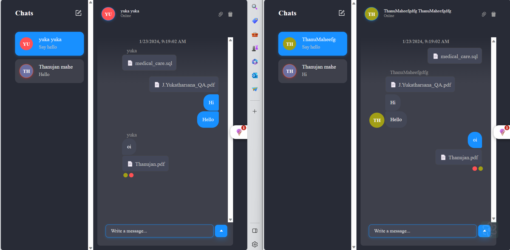

<p align="center">
  
</p>

# Real-Time Chat App

Create a real-time chat application using , , , and . This project enables seamless communication with features such as real-time chat functionality, user authentication, and authorization.

## Technologies Used

The application leverages various technologies:

- **:** A powerful JavaScript library for building user interfaces.
- **:** A fast and efficient frontend build tool.
- **:** A JavaScript runtime for server-side development.
- **:** A scalable and customizable chat API service.

## Screenshots

<p align="center">
  
</p>

Explore the application's visual appeal through the provided screenshot. For more visuals, check out additional screenshots [here](/path/to/screenshots.md).

## Getting Started

1. **Clone the repository:**

   ```bash
   git clone https://github.com/ThanuMahee12/ME-R-A-N-Learn.git
   ```

2. **Install dependencies:**

   ```bash
   cd ui
   cd api
   npm install
   ```

3. **Start the development server:**

   ```bash
   npm start
   npm run dev
   ```

4. **Visit [http://localhost:5123](http://localhost:5123) in your browser.**

## Documentation

For detailed instructions and documentation, refer to [Documentation](https://vitejs.dev/).


## License

This project is licensed under the [MIT License](/path/to/LICENSE).
